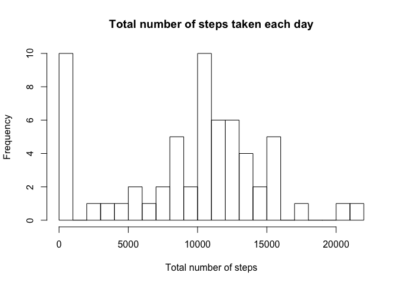
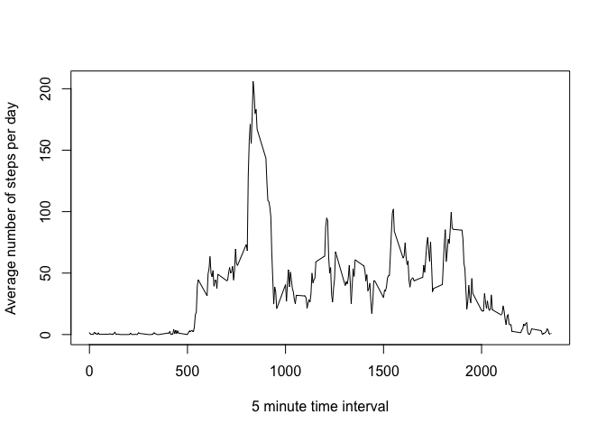
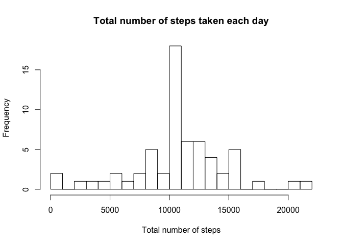
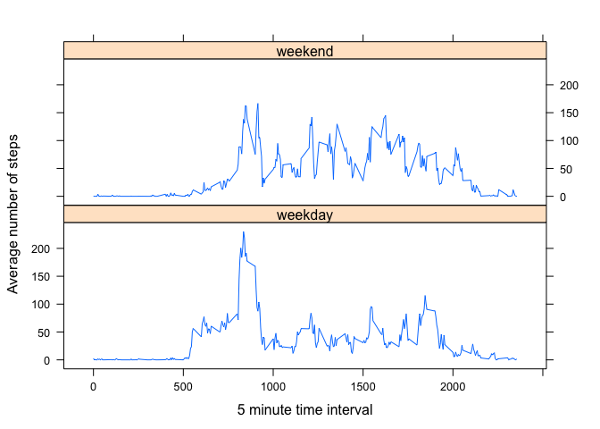

# Reproducible Research: Peer Assessment 1


## Loading and preprocessing the data

1. File loaded
2. Different datasets created from original file to create new data  frames with only the relevant information.

```r
activitydata <- read.csv("activity.csv", stringsAsFactors=FALSE)
activitydata$date <- as.POSIXlt(activitydata$date, format="%Y-%m-%d")
library(plyr)
totalsteps <- ddply(activitydata, .(date), summarize, totsteps = sum(steps, na.rm=TRUE))
databyinterval <- ddply(activitydata, .(interval), summarize, avgsteps = mean(steps, na.rm=TRUE))
```


## What is mean total number of steps taken per day?

1. Total number of steps taken per day already in totalsteps data frame
2. Histogram of total number of steps taken each day

```r
hist(totalsteps$totsteps, breaks = 20, main ="Total number of steps taken each day", xlab = "Total number of steps")
```

 

3. Mean and median total number of steps taken per day 

```r
mean(totalsteps$totsteps)
```

```
## [1] 9354.23
```

```r
median(totalsteps$totsteps)
```

```
## [1] 10395
```


## What is the average daily activity pattern?

1. Time series plot (using databyinterval data frame created above)

```r
intervalstimeseries <- ts(databyinterval)
plot(intervalstimeseries[,1], intervalstimeseries[,2], type="l", ylab="Average number of steps per day", xlab="5 minute time interval")
```

 
  
  2. Time interval with maximum average steps

```r
intervalsorder <- databyinterval[order(databyinterval$avgsteps, decreasing=T),]
intervalsorder[1,1]
```

```
## [1] 835
```


## Imputing missing values

1. Calculate and report total number of missing values (NAs). True is the number of NAs.

```r
narows <- is.na(activitydata)
table(narows)
```

```
## narows
## FALSE  TRUE 
## 50400  2304
```

2. Create new dataset equal to original dataset
3. Replace missing values with average steps for time interval (databyintervals data frame)


```r
library("car")
newactivity <- activitydata
newactivity$steps <- recode(newactivity$steps, "NA=databyinterval$avgsteps")
```

4. Histogram, mean, and median of total number of steps per day.

```r
totalsteps2 <- ddply(newactivity, .(date), summarize, totsteps = sum(steps))
hist(totalsteps2$totsteps, breaks = 20, main ="Total number of steps taken each day", xlab = "Total number of steps")
```

 

```r
mean(totalsteps2$totsteps)
```

```
## [1] 10766.19
```

```r
median(totalsteps2$totsteps)
```

```
## [1] 10766.19
```

Observations: The mean and median are slightly higher now that the missing values have beein filled in. 


## Are there differences in activity patterns between weekdays and weekends?

1. Create new factor variable with two levels - weekend and weekday

```r
newactivity$day <- weekdays(newactivity$date)
newactivity$day = factor(newactivity$day)
levels(newactivity$day)[c(1,2,5,6,7)] <- "weekday"
levels(newactivity$day)[c(2,3)] <- "weekend"
```

2. Panel plot of 5 minute intervals and average number of steps taken, over weekdays and weekends.

```r
library("lattice")
newinterval <- ddply(newactivity, .(interval, day), summarize, avgsteps = mean(steps))
xyplot(avgsteps ~ interval | day, data= newinterval, layout = c(1,2), type="l", ylab="Average number of steps", xlab="5 minute time interval" )
```

 

Observations: Steps are more evenly distributed throughout the day during weekends.
